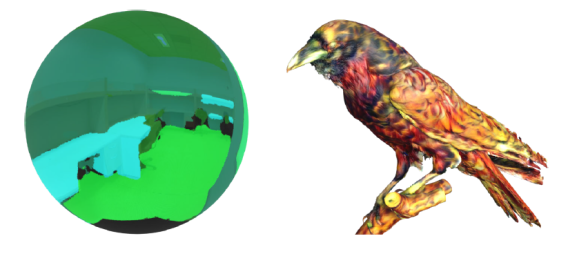

# Interpolated SelectionConv

**This repo is currently under construction.**

The original Pytorch Geometric implementation for Interpolated SelectionConv for Spherical Images and Surfaces

This code builds off our previous work [SelectionConv](https://github.com/davidmhart/SelectionConv). This page will focus primarily on experiments described in our most recent paper [Interpolated SelectionConv for Spherical Images and Surfaces]().

## Install
This work relies heavily on the [Pytorch](https://pytorch.org/) and [Pytorch Geometric](https://www.pyg.org/) libraries. Make sure to have functioning versions of both libraries. The rest of the needed packages can be installed using the `requirements.txt` file.

This code was tested with Python 3.9, Pytorch 1.11 (CUDA Toolkit 11.3), and Pytorch Geometric 2.0.4 on Windows and Ubuntu Linux.

## Interpolation in Selection-based Convolution
The main contribution of this paper is adjusting the original SelectionConv paper to allow for interpolated selection values. This allows SelectionConv to operate on any general point cloud along a surface. The code for the modified graph layer is provided in `selectionConv.py`. Various graph structures for different irregular image types are given in `graph_io.py`. Specifically, the new contributions of this work  that use interpolated graphs are givin in functions `sphere2Graph()` and `mesh2Graph()`. These graph structures can then be used for a variety of tasks.

### Spherical Style Transfer
Spherical style transfer has been improved to use the interpolated graph structure. The general style transfer script can be found at `scripts/styletransfer.py`. We use [Learning Linear Transformations for Fast Image and Video Style Transfer](https://openaccess.thecvf.com/content_CVPR_2019/papers/Li_Learning_Linear_Transformations_for_Fast_Image_and_Video_Style_Transfer_CVPR_2019_paper.pdf) by Li et. al. for our base style transfer method.

Setup:
- Download the needed weights from the [Github page](https://github.com/sunshineatnoon/LinearStyleTransfer) or the [Google drive](https://drive.google.com/file/d/1H9T5rfXGlGCUh04DGkpkMFbVnmscJAbs/view) link. Extract the models to `graph_networks/LinearStyleTransfer/models/`.
- We provide various example content images from our paper in `input_ims/` and various style images in `style_ims/`, but you can use images from any personal directory.

An example command:

``python scripts/styletransfer.py input_ims/test360.jpg style_ims/style3.jpg --image_type sphere``

A viewer for spherical images is also provided in `360viewer.py`.

### Spherical Segmentation
In our paper, we evaluate spherical segmentation on the [Stanford2D-3D-S](https://github.com/alexsax/2D-3D-Semantics) dataset. Code for our evaluation can be found in the `segmentation_eval/` folder.

Setup:
- Download the [Stanford2D-3D-S](https://github.com/alexsax/2D-3D-Semantics) dataset and modify `segmentation_eval/config.py` and `segmentation_eval/config_eval.py` to point to the correct directory.
- Download our pretrained weights and place them in the folder `graph_networks/pretrained_weights`:
  - Trained on RGB-D planar images: [UNet_2d3ds_withDepth.pth]()
  - Fine-tuned on spherical RGB-D images: [UNet_2d3ds_withDepth_finetuned.pth]()

Evaluation:
- To run the evalation using our fine-tuned weights, use `run_eval_finetuned.py`.
- To run the evaluation using our direct transfer weights, use `run_eval_UNet.py`.

Training:
- To fine-tune the weights on a different spherical representation, modify and run `finetune_segmentation.py` according to your specific needs.
- To train from scratch on planar images, modify and run `pretrain_segmentation.py` according to your specific needs.

### Mesh Style Transfer
Mesh style transfer has also been improved using the interpolated graph structure. The mesh style transfer script can be found at `scripts/styletransfer_mesh.py` and uses the same style transfer setup steps as spherical images. Download our [Mesh Data](https://drive.google.com/file/d/1inUhabyPW_fz_2L6FSomxy9-1EQsi8l6/view?usp=sharing) to run the same experiments as in our paper. Use the `-N` command to change the sampling density on the mesh. You can also add new meshes by adding them to the `mesh_data/` folder and modifying the `mesh_config.py` file.